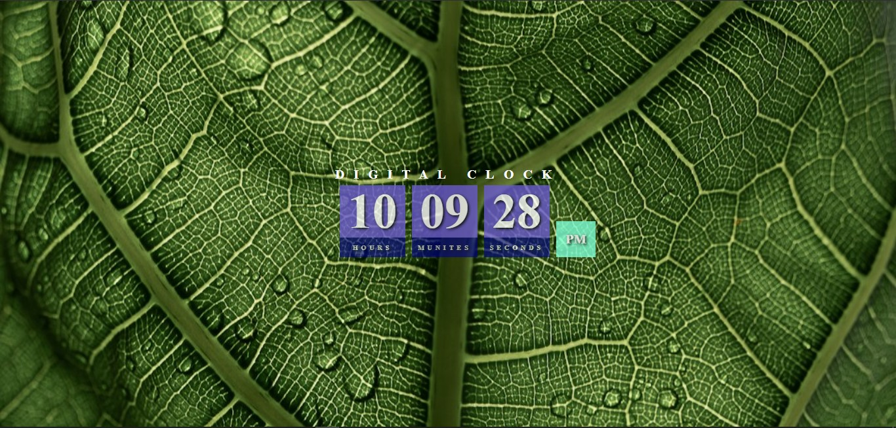

# Digital Clock

A simple digital clock built using HTML, CSS, and JavaScript. This project displays the current time in hours, minutes, and seconds, updating every second.

## Features

- **Real-Time Display**: Shows the current time.
- **Smooth Updates**: Automatically refreshes every second.
- **Customizable Design**: Easy to modify the appearance using CSS.
- **Lightweight**: Built solely with HTML, CSS, and JavaScript.

## Demo



## How to Use

1. **Clone the repository**:
   ```bash
   git clone [github Link](https://github.com/BrahimAzzaf/Digital_Clock.git)
2. Navigate to the project directory:
cd double-landing-page

3. Open index.html in your browser to view the page.
